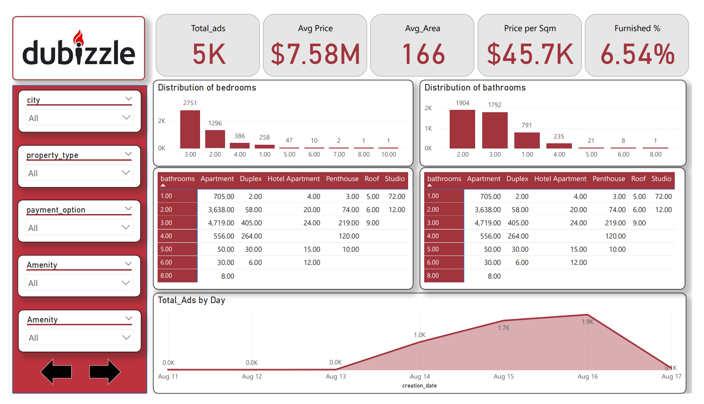
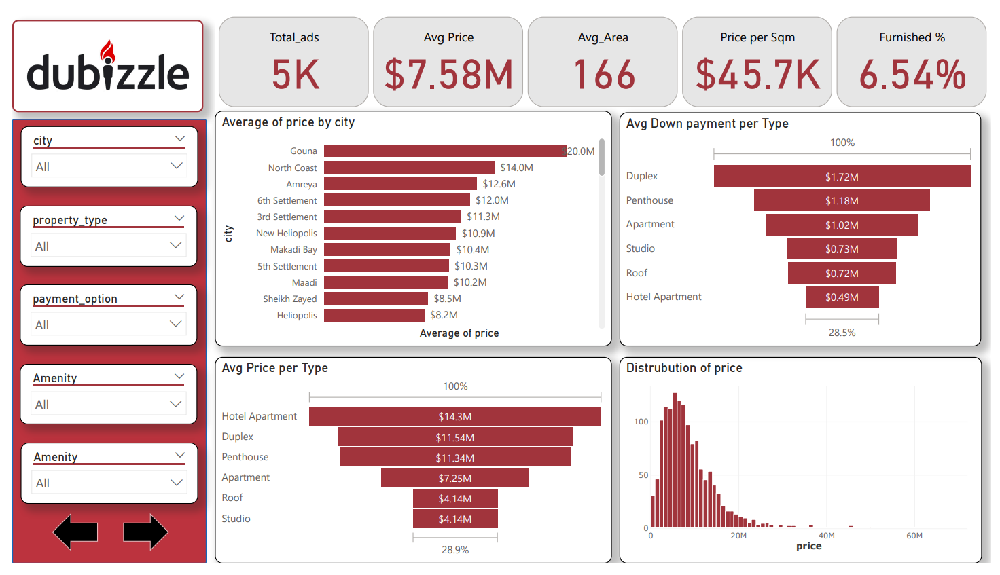
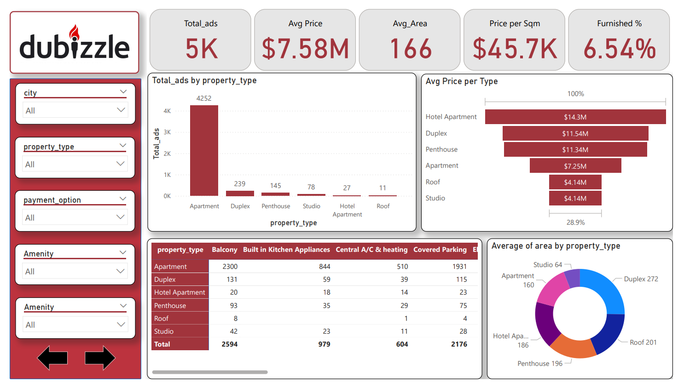
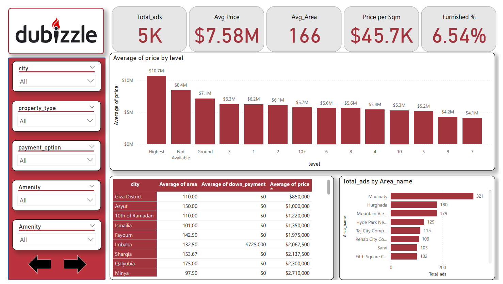
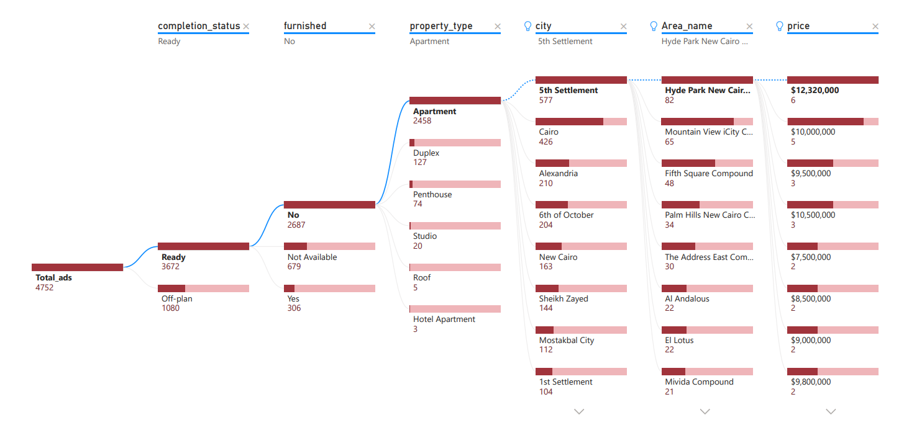

# Dubizzle Property Price Prediction & Analytics Dashboard

## Overview
This project analyzes real estate listings scraped from Dubizzle (Egypt's leading classifieds platform) for apartments and duplexes for sale. It includes a web scraping pipeline, exploratory data analysis (EDA), machine learning models for price prediction, a Power BI dashboard for visualization, and a Streamlit web app for interactive price predictions. The dataset covers ~5K ads with details like price, area, bedrooms, bathrooms, location, amenities, and more. Key insights reveal trends in pricing (avg $7.58M EGP), furnished properties (6.54%), and high-demand areas like Madinaty and Hurghada.

The project empowers users to explore market trends, predict property prices, and visualize distributions across cities, property types, and amenities. Built with Python for scraping/EDA/ML and Power BI for dashboards.

Key Highlights:
- **Total Ads**: 5K
- **Avg Price**: $7.58M EGP
- **Avg Area**: 166 sqm
- **Price per sqm**: $45.7K EGP
- **Furnished %**: 6.54%
- **Top Property Type**: Apartment (4.25K ads)
- **Best Model (R²)**: Gradient Boosting (0.99)

## Data Source
- **Scraping**: Python script using `requests` and `BeautifulSoup` to collect ~5K unique listings from [Dubizzle Apartments for Sale](https://www.dubizzle.com.eg/en/properties/apartments-duplex-for-sale/).
- **Columns**: link, title, price, down_payment, location (city/area_name), creation_date, property_type, ownership, area, bedrooms, bathrooms, furnished, level, payment_option, completion_status, amenities, ad_id, seller_type, seller_name, seller_member_since.
- **Data Prep**: Cleaned with pandas (regex for numerics, date parsing, null filling via groupby means/modes); feature engineering (amenities flags like has_garden, price_per_sqm); saved as `Dubizzle_properties_cleaned.csv`.
- **Total Records**: 4,966 (after deduping/cleaning).
- **Sample Data** (first few rows):
  | link | title | price | down_payment | location | creation_date | property_type | ... |
  |------|-------|-------|--------------|----------|---------------|---------------|-----|
  | https://... | Spacious 3BR in Madinaty | 7500000 | 0 | Madinaty, Cairo | 2025-08-15 | Apartment | ... |
  | https://... | Luxury Duplex Hurghada | 11500000 | 1720000 | Hurghada, Red Sea | 2025-08-14 | Duplex | ... |

- **Challenges**: Handled 403 errors, duplicates, and "Not Available" values; rate-limited requests.

## EDA Highlights
- **Distributions**: Prices skewed high (median ~$5M); most properties unfurnished (93.46%); Apartments dominate (85.7%).
- **Correlations**: Strong positive corr between price/area (0.85), bedrooms (0.72), bathrooms (0.68).
- **Trends**: Ads peak mid-week; top areas: Madinaty (321 ads), Hurghada (180); avg down payment highest for Duplex ($1.72M).
- **Visuals**: Histograms (price), boxplots (price by type), heatmaps (rooms vs. type), scatterplots (price vs. amenities), pie charts (ownership: Primary 78.5%).

## Modeling
- **Target**: Predict `price` (log-transformed for normality).
- **Features**: 20+ (categorical: property_type, city; numeric: area, bedrooms; binary: has_pool, etc.).
- **Preprocessing**: OneHotEncoder for cats, StandardScaler for nums; VIF checked (no multicollinearity >5).
- **Train/Test Split**: 75/25 stratified by property_type.
- **Models Evaluated** (R² on test):
  - Linear Regression: 0.82 (MAE: ~1.2M EGP)
  - Random Forest: 0.95 (MAE: ~450K EGP)
  - **Gradient Boosting**: 0.99 (MAE: 167K EGP, RMSE: 485K EGP) – Best performer
  - XGBoost: 0.98 (MAE: ~200K EGP)
  - LightGBM: 0.97 (MAE: ~300K EGP)
- **Feature Importance**: Area (0.35), bedrooms (0.22), location_encoded (0.15), bathrooms (0.12).
- **Metrics**: Cross-val R² (0.99 ± 0.002); residuals normal (Shapiro p<0.05, but Q-Q plots confirm usability).
- **Saved Models**: `.pkl` files for each; enhanced data in `Dubizzle_properties_enhanced.csv`.

## Dashboard
Power BI dashboard with 5 pages visualizing KPIs, distributions, and trends:
- **Overview**: Total Ads (5K), Avg Price ($7.58M), Furnished % (6.54%); daily ads line chart.
- **Price Analysis**: Avg price by city/type (Gouna: $20M); down payment bars.
- **Property Breakdown**: Ads by type (Apartment: 4.25K); amenities matrix.
- **Location Insights**: Ads by area (Madinaty: 321); price by level (Highest: $10.7M).
- **Filters**: City, type, payment, amenities; interactive slicers.

## Streamlit App
Interactive web app for price prediction:
- **Features**: Input form for area, bedrooms, city, amenities checkboxes; uses Gradient Boosting model.
- **Output**: Predicted price (EGP), city range comparison, bar chart.
- **Run**: `streamlit run app.py` – Displays metrics table and warnings for outliers.
- **UI**: Custom CSS for modern look; wide layout.

## Dashboard Screenshots
Replace placeholders with actual image paths (e.g., `images/screenshot1.png`) when uploading to GitHub.

### 1. Power BI Overview - KPIs & Daily Ads

### 2. Price by City & Type

### 3. Property Type & Amenities

### 4. Location & Level Pricing

### 5. Tree Map

## Key Insights
- **Pricing**: Duplex/Penthouse premium (avg $11M+); unfurnished cheaper by 20%.
- **Demand**: 5th Settlement (577 ads); Ready status (73.4% of listings).
- **Amenities Impact**: +Garden/Pool boosts price 15-25%; Balcony/Parking essential for Apartments.
- **ML Value**: Models predict within ±167K EGP (1.5% error); area/location drive 50% variance.
- **Recommendations**: Target Madinaty for volume; promote furnished in high-end areas for 10% uplift.

## How to Run
1. **Prerequisites**: Python 3.10+, Power BI Desktop, pip install -r requirements.txt (pandas, numpy, scikit-learn, xgboost, lightgbm, streamlit, plotly, wordcloud, etc.).
2. **Scraping/EDA**:
   - Run `scraper.py` for raw data.
   - Run `eda.py` for cleaning/visuals (outputs plots & cleaned CSV).
3. **Modeling**:
   - Run `modeling.py` to train/save models (outputs .pkl & comparison plots).
4. **Dashboard**:
   - Open `Dubizzle_Dashboard.pbix` in Power BI; refresh with cleaned CSV.
5. **App**:
   - `streamlit run app.py` – Predict prices interactively.
6. **Publish**: Upload PBIX to Power BI Service; host Streamlit on Streamlit Cloud.

## Tech Stack
- **Scraping/EDA/ML**: Python (pandas, numpy, scikit-learn, matplotlib, seaborn, plotly, xgboost, lightgbm)
- **Dashboard**: Power BI Desktop (DAX measures, slicers, visuals)
- **App**: Streamlit (forms, predictions, Plotly charts)
- **Other**: BeautifulSoup (scraping), WordCloud (seller names), regex (cleaning)

## Future Enhancements
- Real-time scraping with Selenium for anti-bot.
- Advanced ML: Neural nets (TensorFlow) or ensemble stacking.
- Geospatial maps in Power BI; Arabic NLP for titles.
- API endpoint for predictions.

